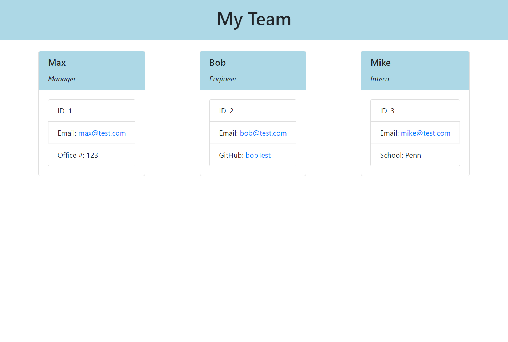

# team-profile-generator

## Description
The purpose of this project was to generate a team profile webpage based on user input from the command line. Once the app is started via node index.js, the user is prompted to fill out the project managers info. After that is completed, the user is given the option to add an engineer, intern, or finish the team. The engineer, intern, and manager have one difference in their profile. They are a github profile for the engineer, school for the interns, and office number for the manager. After all employees have been added, an index.html is generated with each employee on a card. The gitHub profiles are clickable and the emails open the default email program. While creating this project, I got expierence with the jest tests and arrow functions. I also got more practice with the inquirer and fs packages.  

## Table of Contents 
- [Installation](#installation)
- [Usage](#usage)
- [Credits](#credits)
- [License](#license)
- [Features](#features)
- [Tests](#tests)

## Installation
In order to run this application, the inquirer, jest, and fs packages need to be installed. If there is no package.json file, run npm init. Then run npm i inquirer to install the inquirer package. Then install the jest test suite package by runnning npm install --save-dev jest in the command line. Then the application is ready to be run from the terminal. 
## Usage
A video tutorial can be found here [Video tutorial](https://drive.google.com/file/d/1rivH68e8yCEMmPezEEvUQNdDI9gvo8LR/view?usp=sharing)
The generated html document from the tutorial displays the following.

The application can be started by running node index.js. After all questions are answered and the finish option is selected, an html document is generated with the input data. To run the tests on the classes/subclasses, run the command npm test.

## Credits

1. [MDN](https://developer.mozilla.org/en-US/)
2. [W3](https://www.w3schools.com/)
3. [Node.js](https://nodejs.org/en/docs/)
4. [npmjs](https://www.npmjs.com/package/inquirer)
5. [Youtube](https://www.youtube.com/watch?v=bJY3KfM77pc)

## License

## Features
1. command line program for user input on employee info
2. various classes and subclasses
3. Tests for each class and their respective functions
4. generated html document based on the employee info added.

## How to Contribute
If there are any suggestions to improve this generator, this is my [GitHub](https://github.com/MaxStump13) account. 

## Tests
Tests can be found in the tests folder. Each one confirms the class functions from the parent class work properly. They also check the functions specific to the subclasses. To run the tests, use the command npm test in the command line. 